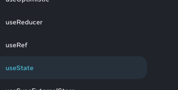

Ashley's notes:
    I couldnt bring all the features together using the useState(), I know its possible but I was having issues making it click in my head with the parts all depending on each other such as timer, score, so I went into the offical documents (react) to get my logic together and found out about useReducer which clicked really fast and made more sense to me. I learned that useState is meant for simple states that are independent and its best practice to use useReducer when its a bit more complex and states depend on each other. I also learned about useRef as they were all groups together.
  
 https://react.dev/reference/react/useState

 I used the official documents and other examples from w3 schools and MDN to set up a basic what I thought was correct based off that as a starting point:

<details>
<summary>Original code</summary>

```javascript
const intialGameState = { //this sets intial states for game compariable to useState initial values
  questions: [],
  currentQuestion: 0,
  score: 0,
  timeRemaining: 0, //will be set based on settings later, ex: timeRemaining: settings.timeLimit but need variables/props/whatever  passed first
  isGameOver: false,
  currentQuestion: null,
  isCorrect: null, //will be boolean to check if answer is correct later
};
// revisit to make it so it fetches one question from API at a time instead of all at once? or maybe keep all at once for easier navigation back and forth? Will come back later because back end logic
// will determine best way  
const gameReducer = (state, action) => {           //this function handles ALL state changes based on action types passed to it instead of multiple handler functions, I could cry, beautiful.
  switch (action.type) {                                            //action.type the action performed is passed to the reducer then it does its magic based off the type,  type is a string that shows what action to perform
    case 'LOAD_QUESTIONS':                                   //so when 'Load_QUESTIONS' === action.type then the return runs
      return {                                                                  //Dont be me, commas after each state property COMMMAASSSS
        ...state,                                                               //spread so its own individual state and not overwrite other states below
        questions: action.payload,                              //payload is data passed with the action so here it would be the the fetched questions from API.    state:property = action.payload
        currentQuestion: action.payload.question,
                //score: I am not changing because it is not being reset or used on load questions action
        timeRemaining: action.payload.timeLimit,    //resetting timer each time a question loads based off settings
        selectedQuestion: null,                                      //reset so no question is selected
        isCorrect: null,                                                     //reset so no answer is marked correct or incorrect yet
                //isGameOver not changing on load questions action
      };
    case 'ANSWER_QUESTION': // so now when a question is answered this action type will run
      const isCorrect = action.payload === state.currentQuestion.correct_answer; //setting up what isCorrect does which is comparing selected answer to the correct answer
      return {
        ...state,
        selectedAnswer: action.payload,                                 //setting selected answer to the answer passed with the action that was chosen
             //questions: not changing  - unreleated
             //currentQuestion: unrelated
              // timeRemaining: No time remaining once answer is selected
        score: isCorrect ? state.score + 100 : state.score, //using isCorrect boolean to determine if score should be increased or not when correct increases score by 100 points
             // ? above is checking if boolean is true like "Yo, is this true ?"          isGameOver: Unchanged, we will handle next question before game ends with button click
      };
    case 'NEXT_QUESTION':
      const nextIndex = state.currentQuestionIndex + 1; //incrementing question so that it counts up by 1 each 
      const isGameOver = nextIndex >= state.questions.length; // each time next question loads then check if the current index is equal to total questions to determine if end of game
      return {
        ...state,
        currentQuestionIndex: nextIndex,
        currentQuestion: isGameOver ? null : state.questions[nextIndex],
        isGameOver,
        isCorrect: null,
      };
    case 'TICK_TIMER':
      return {
        ...state,
        timeRemaining: Math.max(0, state.timeRemaining - 1),
      };
    case 'RESET_GAME':
      return intialGameState;
    }
  };
```

</details>